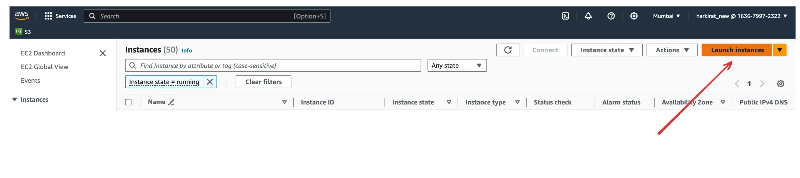
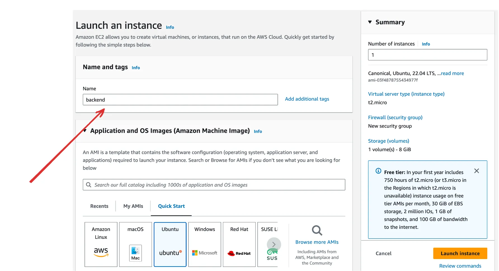
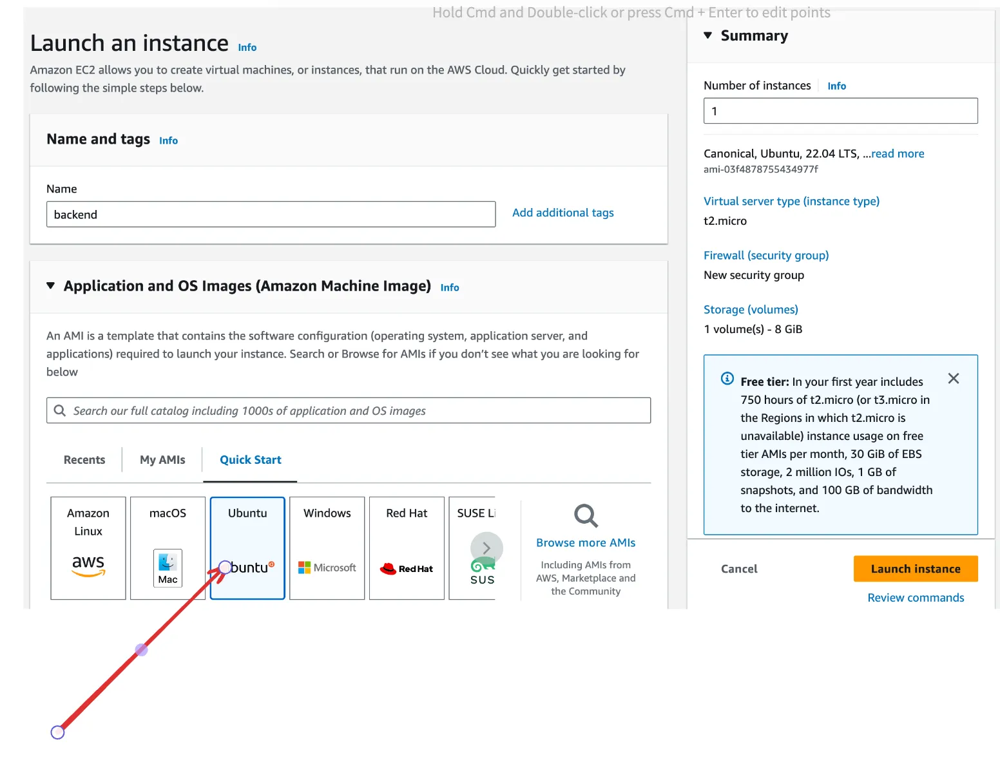
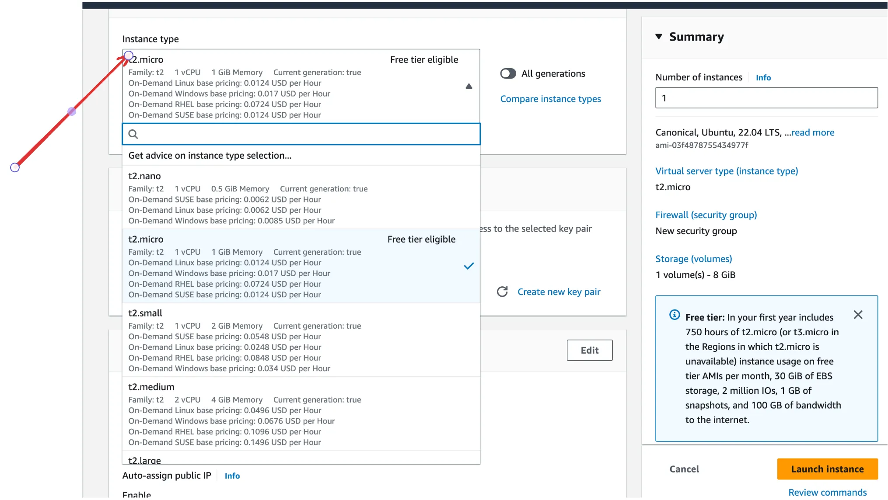
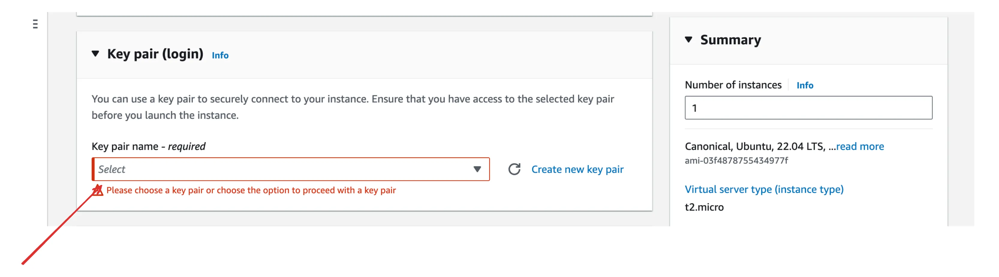
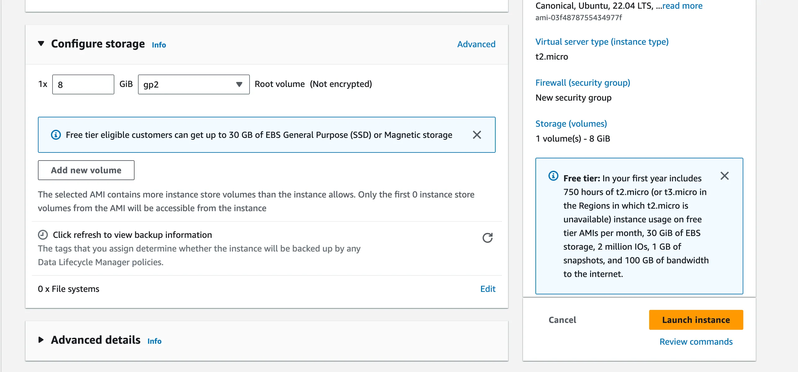
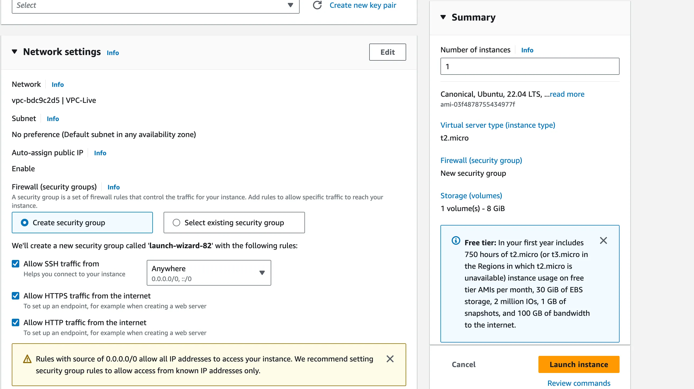
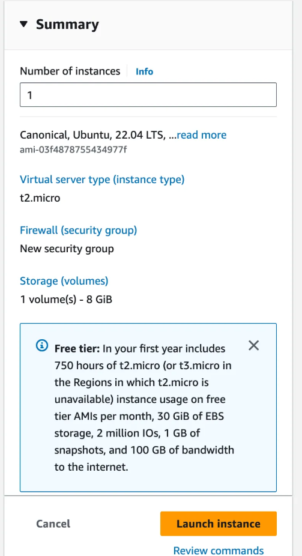

# 🚀 Launching an EC2 Instance

You can **spin up** (i.e., launch) a new EC2 instance directly from the [AWS Management Console](https://aws.amazon.com/console/) .

## 1. Go to the EC2 Dashboard

Navigate to the [EC2 section](https://console.aws.amazon.com/ec2/home) from the AWS Management Console.

## 2. Click on Launch Instance

Start the process of creating a new virtual server.  

## 3. Give it a Name

## 4. Select an Operating System (OS)

Choose from Amazon Linux, Ubuntu, Windows, etc., depending on your project needs.  

## 5. Choose an Instance Type (Size)

Pick a machine size — for beginners, `t2.micro` or `t3.micro` (Free Tier eligible) is recommended.  

## 6. Create or Select a Key Pair

Key pairs allow you to securely SSH into your EC2 instance.  

## 7. Configure Storage

Modify the default storage if needed (optional).  

## 8. Configure Security Group – Allow Traffic

✅ Make sure to allow traffic on the following ports:

-   **HTTP (Port 80)** – For web traffic
-   **HTTPS (Port 443)** – For secure web traffic

## 9. Review and Launch

Review your configuration and hit **“Launch”** to create your instance.  

> 💡 **Tip**: Make sure you understand AWS Free Tier limits to avoid unexpected charges.

---