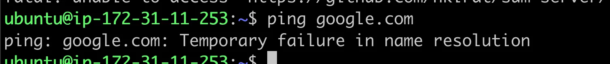

# 🔐 Connecting to Your EC2 Instance via SSH

Once your instance is running, you can connect to it using your terminal.  
Open your terminal and Navigate to the folder where your key pair `.pem` file is stored.

## 1. Give SSH key permissions

Before connecting to your EC2 instance, set proper permissions for your `.pem` key:

```bash
chmod 700 your-key-name.pem
```

Replace `your-key-name.pem` with the name of your downloaded key file.

---

## 2. SSH into Your EC2 Instance

Use the following command to connect to your instance:

```bash
ssh -i your-key-name.pem ubuntu@your-ec2-public-dns
```

-   Replace `your-key-name.pem` with your actual key.
-   Replace `your-ec2-public-dns` with the **Public DNS** of your EC2 instance.

---

## 3. Clone Your GitHub Repository

```bash
git clone https://github.com/your-username/your-repo-name.git
```

Navigate into the project folder:

```bash
cd your-repo-name
```

> 💡 **Troubleshooting DNS Errors?**  
> If your aws machine shows you the following error, your aws machine doesn’t have access to the internet.  
> **Fix it using this guide:** [How to Fix Name Resolution Issue](https://www.tecmint.com/resolve-temporary-failure-in-name-resolution/)  
> 

---

## 4. Install Node.js

Follow this official guide to install Node.js on Ubuntu 20.04:  
👉 [Install Node.js – DigitalOcean](https://www.digitalocean.com/community/tutorials/how-to-install-node-js-on-ubuntu-20-04)

> Or quick install via terminal:

```bash
curl -fsSL https://deb.nodesource.com/setup_18.x | sudo -E bash -
sudo apt install -y nodejs
```

---

## 5. Install Project Dependencies

Once inside your project directory, run:

```bash
npm install
```

This installs all required packages listed in your `package.json`.

---

## 6. Start Your Backend Server

```bash
node index.js
```

Or if you’re using another entry file (like `server.js` or `app.js`), replace accordingly.

---

## You’re Live!

Visit your EC2's public IP (with correct port, e.g., `:3000`) in the browser to see your app.

> 🛡️ Make sure the **Security Group** allows inbound traffic on the port your app is using (e.g., 3000, 80, 443).

---

✅ Next Steps

-   [Security Groups in AWS](4.%20Accessing%20Server%20and%20PM2.md)
-   [Set-up PM2 ](./4.%20Accessing%20Server%20and%20PM2.md)
-   [Configure Nginx](./5.%20NGINX.md)

---