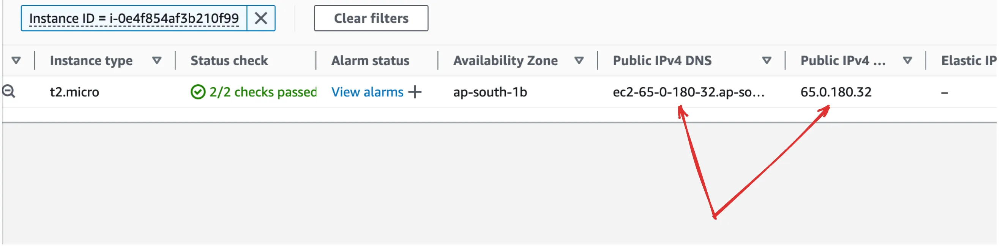
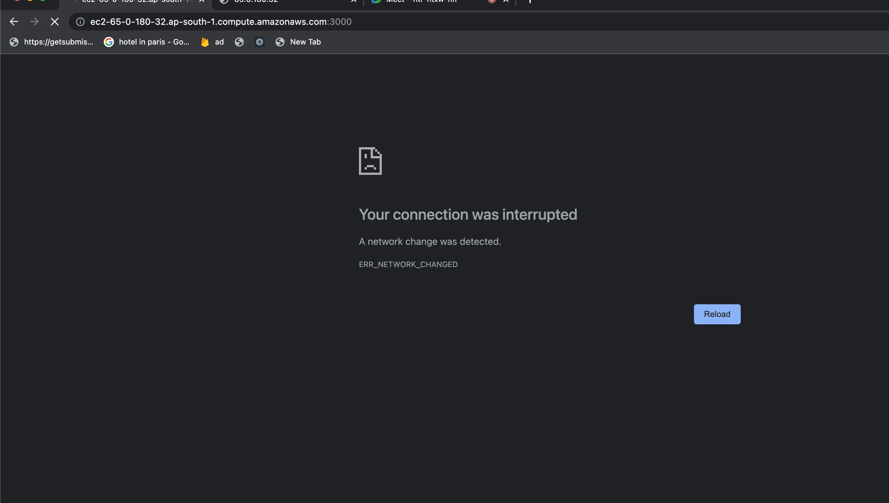
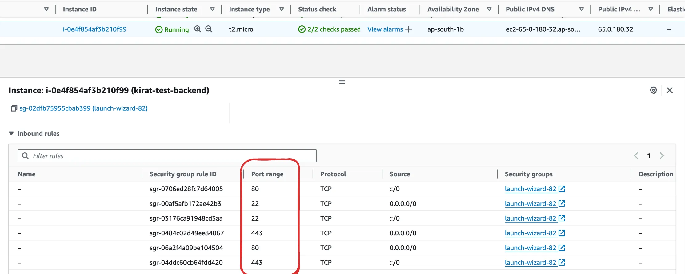
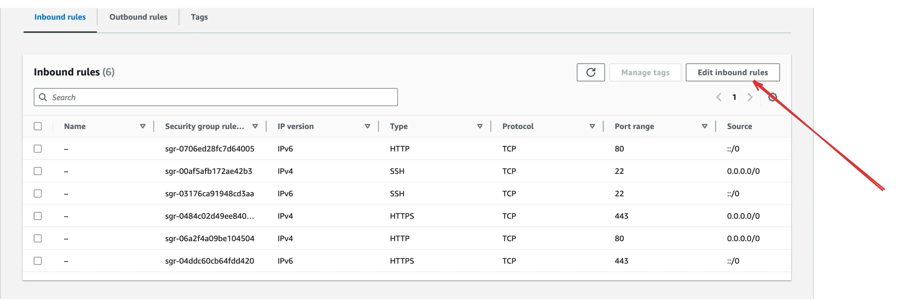
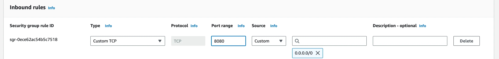

# 🚀 Accessing Your EC2 Server

Once your EC2 instance is up and running, you’ll receive a **Public IP** or **Public DNS**.  

You can use this to access your backend server from the browser or Postman.

## ❌ Facing Access Issues?

If your server is running and you still can't access it via the browser, it's likely due to **security group** restrictions.  


---

## 🔐 Security Groups in AWS

Security groups act like a firewall at the instance level.  
By default, only port `22` (for SSH) is open.

To access your backend on ports like `3000` or `8080`, you’ll need to open these manually.

---

## ✅ Solution: Open Required Ports

1. Go to your EC2 Dashboard.
2. Select your instance → Go to the **Security** tab → Click on the **Security Group**.
3. Click **Edit Inbound Rules**.  
   
4. Add a rule:
    - Type: `Custom TCP`
    - Port: `3000` or `8080`
    - Source: `Anywhere (0.0.0.0/0)` (for public access)
      

5. Save the rules.

---

## 🔁 Alternate: Use Port 80 (HTTP)

If you prefer not to expose custom ports publicly, run your backend on port `80` (default HTTP):

```bash
sudo npm install -g pm2
pm2 start index.js --name your-app-name -- --port 80
```

Or configure a **reverse proxy** using **Nginx** to expose port `80` while your server listens on `3000` internally.

More on reverse proxy setup: [Nginx Reverse Proxy Guide](./5.%20NGINX.md)

---

### 🌍 Try Again

After updating the security group.  
You should now see your backend app responding correctly.

---

# Use PM2 for Production Deployment

PM2 keeps your app running in the background, restarts it on crashes, and simplifies monitoring.

## 1. Install PM2:

```bash
npm install -g pm2
```

## 2. Start your app with PM2:

```bash
pm2 start index.js
```

> Replace `index.js` with your entry file name.

## 3. Save the process list and auto-start on reboot:

```bash
pm2 save
pm2 startup
```

---

✅ Next Step - [Configure Nginx](./5.%20NGINX.md)