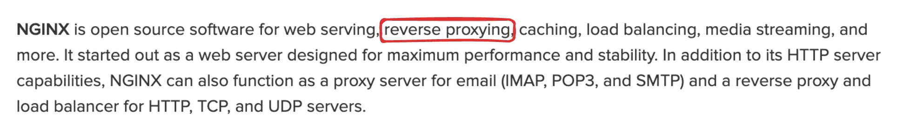
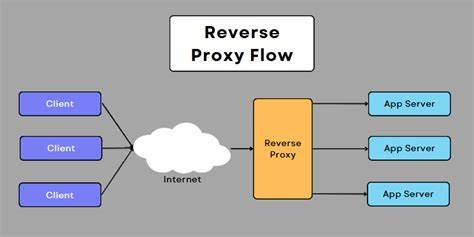
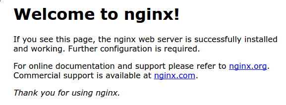

# 📘 What is Nginx?

Nginx is a high-performance HTTP server, reverse proxy, and load balancer.  
More details: [What is Nginx?](https://www.nginx.com/resources/glossary/nginx/)



---

## 🔁 What is a Reverse Proxy?

A reverse proxy is a server that sits in front of web servers and forwards client (e.g., browser) requests to those web servers. It can also handle SSL termination, caching, load balancing, and more.



---

## 🔧 Installing Nginx

Update your package lists and install Nginx:

```bash
sudo apt update
sudo apt install nginx
```

After installation, Nginx starts automatically and listens on port `80`.

Visit your EC2 public IP in the browser. If this page shows it means Nginx is running.

## 

## 🔁 Create a Reverse Proxy

Replace the default Nginx config:

```bash
sudo vi /etc/nginx/nginx.conf
```

Paste the following configuration:

```nginx
events {
    # Event directives...
}

http {
    server {
        listen 80;
        server_name your-domain.com;

        location / {
            proxy_pass http://localhost:8080;
            proxy_http_version 1.1;
            proxy_set_header Upgrade $http_upgrade;
            proxy_set_header Connection 'upgrade';
            proxy_set_header Host $host;
            proxy_cache_bypass $http_upgrade;
        }
    }
}
```

> Replace `your-domain.com` with your actual domain  
> Replace `localhost:8080` with your backend server’s port if different

---

## 🔄 Reload Nginx

Apply the new config:

```bash
sudo nginx -s reload
```

---

## 🚀 Start Your Backend Server

Run your backend project:

```bash
node index.js
```

Or if using PM2:

```bash
pm2 start index.js
```

---

## 🌍 Visit Your Live Site

Open your domain in the browser:

```
http://your-domain.com
```

You should see your backend responding through Nginx!

---

## 🔐 [Optional] Enable HTTPS with Certbot

To add SSL support and redirect all HTTP traffic to HTTPS, use [Certbot](https://certbot.eff.org/)

Follow the instructions to secure your site with a free SSL certificate from Let's Encrypt.

---
